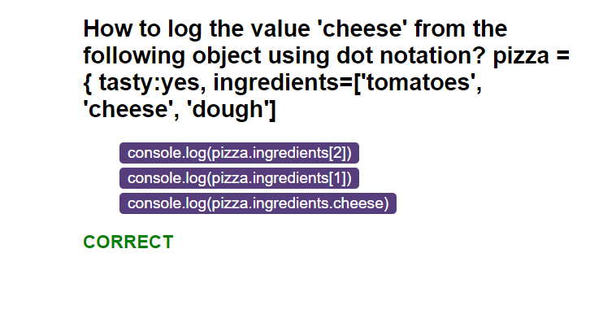
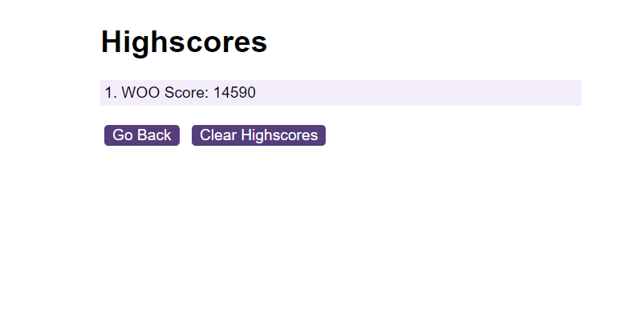

# javascript-quiz

## Description

This application is a JavaScript quiz built in JavaScript. It mainly utilises DOM manipulation and local storage to create the quiz and store high scores. It features 5 questions to test the user's JavaScript skills within a 45 second time limit. The user is penalised by 10 seconds for each incorrect answer, and the app feeds back to the user whether their answer was correct or incorrect via DOM manipulation.

Once the user has completed the quiz (either by completing all the questions or running out of time), the user is able to save their highscore along with 3 identifying initials. The user's highscore is calculated by multiplying their remaining time by the number of correct answers. The user can then go to a separate highscore page to view their highscores, which are sorted in order of greatest value.

## Deployed application

Link to the deployed application: https://callumquirky.github.io/javascript-quiz/

## License

This project uses an MIT license.